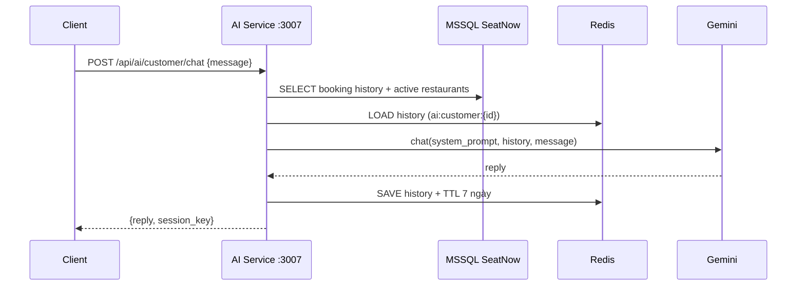

# SeatNow AI Service — Walkthrough

## Cấu trúc thư mục

```
AI-service/
├── .env                        ← Config (port 3007, Gemini key, DB, Redis, JWT)
├── .gitignore
├── requirements.txt
├── main.py                     ← FastAPI app entry point
├── config/
│   ├── db.py                   ← MSSQL (pyodbc) connection
│   └── redis_client.py         ← Redis helpers (save/load/append/clear history)
├── middleware/
│   └── auth.py                 ← JWT verify (customer / admin / internal token)
├── models/
│   └── schemas.py              ← Pydantic request/response models
├── services/
│   ├── data_service.py         ← SQL queries (booking history, restaurants, revenue)
│   └── gemini_service.py       ← Gemini 2.5 Flash wrapper (chat + one_shot)
└── routers/
    ├── customer.py             ← Customer AI endpoints
    └── admin.py                ← Admin AI endpoints
```

---

## Endpoints

| Method | Path | Auth | Mô tả |
|--------|------|------|-------|
| `GET` | `/health` | — | Health check |
| `POST` | `/api/ai/customer/recommend` | JWT (customer) | Gợi ý nhà hàng 1 lần |
| `POST` | `/api/ai/customer/chat` | JWT (customer) | Chat multi-turn |
| `DELETE` | `/api/ai/customer/chat/history` | JWT (customer) | Xóa lịch sử chat |
| `POST` | `/api/ai/admin/revenue-summary` | JWT (admin) | Tổng hợp doanh thu 12 tháng |
| `POST` | `/api/ai/admin/chat` | JWT (admin) | Chat phân tích kinh doanh |
| `DELETE` | `/api/ai/admin/chat/history` | JWT (admin) | Xóa lịch sử chat admin |

---

## Redis Chat History

- Session key customer: `ai:customer:{userId}`
- Session key admin: `ai:admin:{userId}`
- TTL: **7 ngày** → tự xóa sau khi hết hạn
- Format: `JSON array` of `{role, parts}` — tương thích Gemini Content API

---

## Chạy service

```bash
# 1. Vào thư mục
cd "Final Project/AI-service"

# 2. Tạo virtual env & cài deps
python -m venv venv
venv\Scripts\activate        # Windows
pip install -r requirements.txt

# 3. Điền DB_USER / DB_PASSWORD vào .env nếu dùng SQL auth

# 4. Chạy
python main.py
# hoặc
uvicorn main:app --reload --port 3007
```

Swagger UI: http://localhost:3007/docs

---

## Luồng hoạt động


